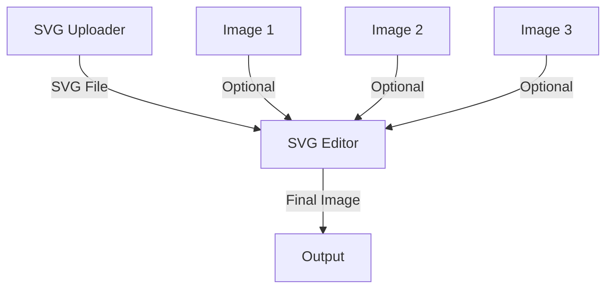

# ComfyUI-SVGFullfill

A ComfyUI custom node that enables SVG file integration and editing. This node allows you to upload SVG files, preview them in real-time, replace images and text elements within the SVG, and export the result as a PNG image.

## Features

- 🖼️ SVG file upload and preview
- 🔄 Replace up to 3 images in SVG
- ✏️ Edit up to 10 text elements in SVG
- 🈯 Full Chinese text support
- 🖼️ Real-time canvas preview
- 📤 PNG export

## Installation

1. Clone this repository to your ComfyUI custom_nodes directory:
```bash
cd ComfyUI/custom_nodes
git clone https://github.com/YourUsername/ComfyUI-SVGFullfill.git
```

2. Install the required dependencies:
```bash
pip install cairosvg Pillow
```

3. Copy your fonts into the font directory:
```bash
cd ComfyUI-SVGFullfill
mkdir font
# Copy your .ttf or .otf fonts into the font directory
```

## Usage

### SVG Requirements

Your SVG file should:
1. Have text elements with id attributes like `text1`, `text2`, etc., for text replacement
2. Have `<image>` elements for image replacement
3. Use UTF-8 encoding (especially important for Chinese text)

Example SVG structure:
```xml
<svg xmlns="http://www.w3.org/2000/svg" width="800" height="600">
    <text id="text1">Replaceable Text 1</text>
    <text id="text2">替换文本2</text>
    <image x="10" y="10" width="200" height="200" />
</svg>
```

### Nodes

The extension provides two main nodes:

1. **SVG Uploader**
   - Allows SVG file upload
   - Provides real-time canvas preview
   - Outputs SVG content to SVG Editor

2. **SVG Editor**
   - Accepts SVG file input from SVG Uploader
   - Has optional inputs for 3 images and 10 text replacements
   - Outputs the final PNG image

### Workflow Example

1. Add SVG Uploader node
2. Add SVG Editor node
3. Connect SVG Uploader's output to SVG Editor's input
4. Upload your SVG file using the SVG Uploader
5. Connect your images to SVG Editor's image inputs (optional)
6. Input text replacements in SVG Editor (optional)
7. Run the workflow to get your final image

### Example Workflow


## Font Support

To use custom fonts (especially for Chinese text):
1. Place your `.ttf` or `.otf` font files in the `font` directory
2. The fonts will be automatically detected and used for rendering

## Known Limitations

- Maximum 3 image replacements per SVG
- Maximum 10 text replacements per SVG
- SVG animations are not supported
- External images in SVG must be base64 encoded

## Contributing

Contributions are welcome! Please feel free to submit a Pull Request.

## License

This project is licensed under the MIT License - see the LICENSE file for details.

## Credits

Thanks to the ComfyUI community for their support and inspiration.